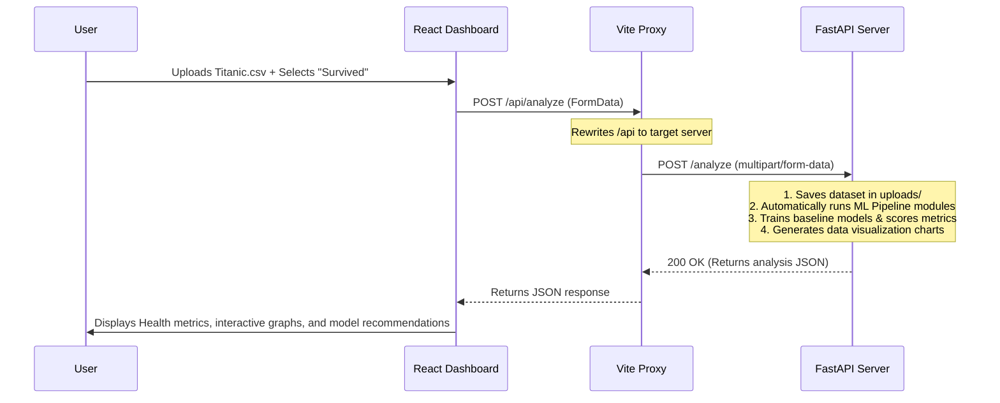

#  ML Compass AI (ML Assistant)

An automated machine learning analysis and evaluation platform designed to help users inspect datasets, check data quality, generate recommendations, and train baseline models through an interactive, premium dashboard interface.

---

## Contributors & Team

This project was built and is maintained by:
* **Kashish Rathod**
* **Sejal Jain**

---

## Problem Statement & Overview

Preparing a raw dataset for machine learning requires a series of tedious, manual, and repetitive tasks:
1. **Data Quality Analysis:** Finding missing values, identifying duplicates, detecting high cardinality, and computing outliers.
2. **Preprocessing Choice:** Determining whether to scale, encode, impute, or drop features.
3. **Model Selection & Comparison:** Training and assessing multiple baseline models to find the best algorithm for the task.

**ML Compass AI** automates this workflow. It ingests a CSV dataset, detects whether the target is a **Classification** or **Regression** problem, executes a multi-stage diagnostic pipeline, generates data visualizations, trains multiple candidate models, and serves these insights via a React dashboard.

---

##  Key Features

###  Frontend (ML Compass AI Dashboard)
* **Dataset Health Score:** A comprehensive visual indicator reflecting the general cleaniness and readiness of your data.
* **Smart Banners & Alerts:** Direct notifications for critical issues like high missingness or duplicate records.
* **Interactive Charts:** High-fidelity, client-side charts mapping class distribution, correlation heatmaps, missing value profiles, feature importance, and model performance comparison.
* **Step-by-Step Pipeline Viewer:** Clear visual indicators showing which stages of the automated ML process have succeeded or encountered warnings.
* **Actionable Recommendations:** Side-by-side lists outlining necessary preprocessing actions and suggested ML models.

###  Backend (FastAPI ML Core)
* **Automated Task Detection:** Distinguishes classification tasks from regression tasks by analyzing target class cardinality.
* **Data Inspection & Profiling:** Checks scaling requirements, class imbalance, feature variance, and multi-collinearity.
* **Feature Selection:** Ranks the most influential columns using random forest feature importances.
* **Model Training & Comparison:** Trains models (Logistic Regression, Decision Trees, Random Forests, XGBoost, CatBoost, etc.) and compares them using metric scoring (Accuracy, F1, MAE, R² Score, etc.).
* **Visualization Generator:** Generates high-quality charts using `Matplotlib` and outputs them directly for the frontend to consume.

---

## Project Structure

```text
ml-assistant/
│
├── backend/                             # Python FastAPI Backend
│   ├── modules/                         # Core Machine Learning Modules
│   │   ├── cardinality_detector.py      # Identifies high cardinality categorical columns
│   │   ├── correlation_detector.py      # Detects highly correlated features
│   │   ├── cross_validation.py          # Performs model cross-validation
│   │   ├── data_quality.py              # Analyzes missing values, rows, columns, and duplicates
│   │   ├── dataset_health_score.py      # Computes overall dataset health metrics
│   │   ├── feature_selection.py         # Selects important features and flags low-impact columns
│   │   ├── graph_generator.py           # Generates visualization PNGs (heatmaps, distributions, etc.)
│   │   ├── hyperparameter_tuning.py     # Simple hyperparameter optimization algorithms
│   │   ├── imbalance_detector.py        # Identifies target class imbalances (classification)
│   │   ├── metric_recommender.py        # Suggests evaluation metrics based on target structure
│   │   ├── model_comparison.py          # Formats and orders model benchmark comparisons
│   │   ├── outlier_detector.py          # Identifies statistical outliers using IQR
│   │   ├── pipeline.py                  # Core analysis pipeline driver orchestrating modules
│   │   ├── pipeline_generator.py        # Orchestrates and validates pipeline generation flow
│   │   ├── possible_challenges.py       # Identifies threats like small datasets or class imbalance
│   │   ├── prepare_pipeline.py          # Builds scikit-learn preprocessors (scaling/encoding/imputing)
│   │   ├── recommend_preprocessing.py   # Generates textual recommendations for raw dataset cleanup
│   │   ├── report_generator.py          # Summarizes pipeline outputs into JSON format
│   │   ├── scaling_detector.py          # Identifies standard scaling or normalization requirements
│   │   ├── suggested_models.py          # Suggests which ML models are relevant to the task
│   │   ├── task_detection.py            # Automatically detects Regression vs. Classification
│   │   └── train_models.py              # Automates baseline model training and prediction evaluation
│   │
│   ├── app.py                           # Main FastAPI server entry point (contains route endpoints)
│   ├── history_index.json               # Local registry storing history of uploaded datasets & metadata
│   ├── graphs/                          # Storage for generated pipeline analysis graphs (gitignored)
│   ├── reports/                         # Storage for complete analysis JSON files (gitignored)
│   └── uploads/                         # Storage for uploaded source CSV files (gitignored)
│
├── frontend-build/                      # React & Vite Frontend Dashboard
│   ├── src/
│   │   ├── assets/                      # Global images, styles, and static assets
│   │   ├── components/
│   │   │   ├── charts/                  # Recharts components (Pie, Bar, Radar, etc.)
│   │   │   ├── layout/                  # Page layout shells (Sidebar, Topbar, Content wrappers)
│   │   │   └── ui/                      # Reusable UI elements (Card, StatCard, Badge, Spinner)
│   │   ├── context/                     # Global State Management (e.g. DatasetContext)
│   │   ├── pages/                       # Page routes (Dashboard, Pipeline, Upload, Reports)
│   │   ├── services/                    # API clients and data fetching layers (FastAPI integrations)
│   │   ├── App.jsx                      # App entry, route setup, and page layout layout wrappers
│   │   └── main.jsx                     # DOM mount point
│   │
│   ├── index.html                       # Entry HTML document
│   ├── tailwind.config.js               # Utility CSS styling config
│   ├── vite.config.js                   # Vite dev server and backend API proxy settings
│   └── package.json                     # Frontend npm dependencies and run scripts
│
├── test.py                              # Local sandbox to run the backend pipeline directly on CSV files
└── README.md                            # Comprehensive project guide (this file)
```

---

##  Installation & Setup

Before starting, ensure you have the following installed:
* **Python 3.8+**
* **Node.js 18+** & **npm**

---

### 1. Backend Setup & Run

Go to the project root directory and run the backend FastAPI server.

#### Option A: Running the FastAPI Web Server (Recommended for GUI Dashboard)
Run the server with Uvicorn:
```bash
python -m uvicorn backend.app:app --reload
```
* Note: Running with `python -m` ensures the root project folder is added to Python's system path, which resolves module paths like `backend.modules.pipeline`.
* The server will run on `http://127.0.0.1:8000`.

#### Option B: Running the Pipeline CLI Sandbox (For quick command line tests)
Modify `test.py` at the root with your custom `.csv` dataset path and target column, then run:
```bash
python test.py
```

---

### 2. Frontend Setup & Run

Navigate to the `frontend-build` directory, install packages, and spin up the development server.

```bash
# Navigate to the frontend folder
cd frontend-build

# Install dependencies
npm install

# Run the development server
npm run dev
```

* The development server will run on `http://localhost:5173`.
* Vite is configured to proxy all `/api` requests to the backend server running at `http://127.0.0.1:8000`.

---

##  Integration & API Architecture

The frontend and backend interact seamlessly through API calls:



* **Vite API Proxying:** Defined in [`vite.config.js`](file:///c:/Users/Sejal%20Jain/Downloads/ml-assisant/frontend-build/vite.config.js), any query sent from React to `/api` is transparently forwarded to `http://127.0.0.1:8000`, bypassing CORS policies and making integration clean.

---

##  Technologies & Stack

* **Frontend:** React, TailwindCSS, Vite, Lucide Icons, Axios, Recharts (for clean, responsive vector graphs)
* **Backend:** FastAPI (Python), Uvicorn, Pandas, NumPy, Scikit-learn, XGBoost, Matplotlib (for visualization rendering)
